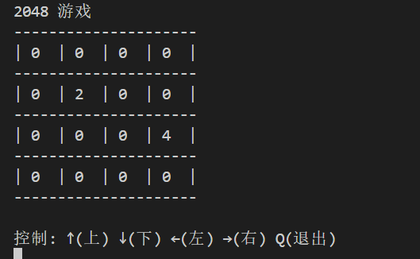

现在让我们来制作java版本的2048游戏:

1.java如何申请变量并存储数字:

在java中,当我们需要申请某个类型的变量时,我们需要指定它的类型.一旦指定类型后,这个变量就不能成为其他类型的值了.

对比python:

```
x=1 # x是数字类型
x="123" #x是字符串类型
```

x可以随意更改其类型.


java:

注意要在main函数里面申请.

```
int x = 1; //定义整数类型变量x并指派值为1
x="123"; //报错!
```

注: java中任何一句"可执行"语句后面都要加上分号.非常麻烦.


```
String y = "123";
y = 1;

```


2.java中的两种整数类型变量:

是的,你没听错.在java中,当你需要一个整数类型变量的时候,你还需要区分,

因为有两种名字的整数类型变量.一种叫做`int`,一种叫做`Integer`. 还是老规矩,一个字都不能打错.

```
int x=1;
Integer y=1;
```

简单来说,我们接下来要用到的变量类型必须得是Integer类型的.

原因比较复杂,之后再解释.


3.java的列表:

由于我们的2048棋盘需要4*4的矩阵,下面我们来介绍java中的列表.




可以想象,会有一个和python中的list类似的,java中的列表版本(事实上,大部分编程语言中都有"列表"这个概念,只有比较老旧的C,C++):

这里顺手讲一下编程语言编年史(发展史).


但是我们需要手动指定其类型.(比python麻烦得多):

注意import.

java一维列表的创建:

// 我们先知道有这句话,之后我们来详细解释.

```
List<Integer> x=new ArrayList<>(List.of(1,2)); //参数列表就是x的内容
// 格式:
// 变量类型1 变量名 = new 变量类型2(初始值);
```

注: List与python不同,是大写的!


解释:

```
List<Integer>: 代表列表里的元素都是Integer类型
x: 变量名
=: java中的赋值语句
new ArrayList<>(); // 创建一个新的数列类型的列表
List.of(1,2); //创建一个列表,内容是1,2
```

(如果嫌这句话太烦,我们先教学数组版本的,但是回头我们要把List这个东西学会的.)


另: Java中创建一个新数组,可以见2-2.


4.列表的读取:

```
// 输出列表的部分内容
System.out.println(x.get(0));
System.out.println(x.get(1));
// 输出整个列表
System.out.println(x);
```


5.列表元素的修改:

```
x.set(index,element);
// 不能写成: x[index]=element;
// 例:
x.set(0,10);
```


6.列表中的元素一经出生就不得再修改类型,只能修改值,因为你已经指定好其类型了.


7.思考: 为什么Java要这么做?其实是为了规范程序员.

Python是为了让程序员自由发挥,Java是为了让程序员"不要自由发挥".


8.创建二维列表并输出(整合所有代码):

```
List<List<Integer>> x = new ArrayList<>(
	List.of(
		List.of(0,0,0,0),
		List.of(0,0,0,0),
		List.of(0,0,0,0),
		List.of(0,0,0,0)
	)	
);
System.out.println("2048 游戏");
System.out.println("-----------------");
# 问题: 在print语句中同时输出多个内容?
print("|",x[0][0], "|", x[0][1], "|", x[0][2], "|", x[0][3])
print("-----------------")
print("|",x[1][0], "|", x[1][1], "|", x[1][2], "|", x[1][3])
print("-----------------")
print("|",x[2][0], "|", x[2][1], "|", x[2][2], "|", x[2][3])
print("-----------------")
print("|",x[3][0], "|", x[3][1], "|", x[3][2], "|", x[3][3])
print("-----------------")
print("控制:WASD,Q退出")
```


9.习题:

请创建一个整形列表={1,2,3},并修改其第三个元素为4,并输出该列表的第三个元素.

答案:

```
```

