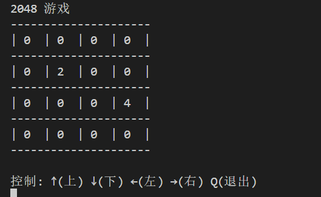

1.java如何申请变量并存储数字:

在java中,当我们需要申请某个类型的变量时,我们需要指定它的类型.

python:

```
x=1 # x是数字类型
x="123" #x是字符串类型
```

x可以随意更改其类型.


java则不可以.当我们指定了变量的类型后,无法再改变变量的类型.

java:

```
int x = 1; //定义整数类型变量x并指派值为1
x="123"; //报错!
```

注: java中任何一句"可执行"语句后面都要加上分号.非常麻烦.


2.java中的两种整数类型变量:

是的,你没听错.在java中,当你需要一个整数类型变量的时候,你还需要区分,

因为有两种名字的整数类型变量.一种叫做`int`,一种叫做`Integer`.还是老

规矩,一个字都不能打错.

```
int x=1;
Integer y=1;
```

对它们做一个简单的区分:


由于我们的2048棋盘需要4*4的矩阵,下面我们来介绍java中的列表.




3.对应地,我们有两种申请处理批量数据的方式(非常搞).

int对应: 二维数组

Integer对应: 二维列表


4.java的列表:

可以想象,会有一个和python中的list类似的,java中的列表:

但是我们需要手动指定其类型.

java一维列表的创建:

```
List<
```


3.

